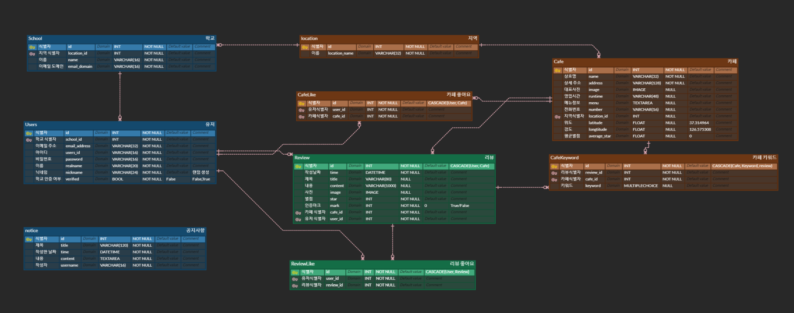

# ☕ NearByCafe

```  
대학생을 위한 카페 검색 및 리뷰 공유 서비스
```
서버 주소 [https://nearbycafe.store]

<br/>

## 🧐문제 인식
 
- 네이버 지도, 카카오맵과 같은 기존 지도 서비스는 사용자 목적에 맞는 카페를 찾기 어려웠습니다.
- 또한, 광고성 정보로 인해 목적과 맞지 않는 카페를 찾을 가능성도 존재했습니다.
- 그러다가 대학생 커뮤니티인 에브리타임에 작성된 학우분들의 맛집 리뷰는 신뢰도가 높게 느껴지는 점을 얼핏 느꼈습니다.
- 그래서 타 지역의 카페를 그 지역 대학생들의 신뢰도 높은 리뷰로 찾을 수 있도록 도와주는 '근처카페'를 고안했습니다.

<br/>

## 🔨 Tools
- <b>Design, Architecture</b> :   
- <b>Framework</b> :   
- <b>Deployment</b> :   
- <b>Collaboration</b> : 

<br/>

## 📝 ERD
